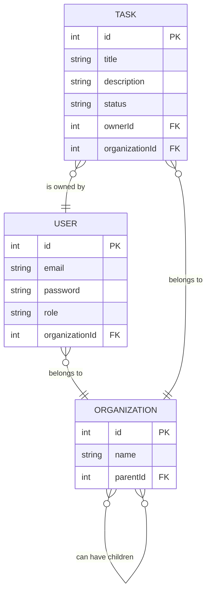

# Secure Task Management System

This project is a full-stack task management application built for a take-home challenge. It features a NestJS backend with a sophisticated role-based access control (RBAC) system and a lightweight Angular frontend, all containerized with Docker for easy setup and evaluation.

## Core Features

- **Authentication:** Secure JWT-based authentication.
- **N-Level Organization Hierarchy:** Supports complex, multi-level organizational structures.
- **Role-Based Access Control (RBAC):** Three distinct user roles (Admin, Owner, Viewer) with granular, hierarchy-aware permissions.
- **Task Management:** Full CRUD (Create, Read, Update, Delete) functionality for tasks.
- **Drag-and-Drop UI:** Users can update task statuses by dragging cards between columns.
- **Dockerized Environment:** A one-command `docker-compose up` setup for easy evaluation.

## Getting Started (Docker - Recommended)

The easiest way to run the entire application is with Docker Compose.

### Prerequisites

- Docker & Docker Compose

### 1. Environment Setup

Create a `.env` file by copying the example:

```bash
cp .env.example .env
```

You can customize the `DASHBOARD_PORT` in this file if needed.

### 2. Run the Application

From the root of the project, run:

```bash
docker-compose up
```

This command builds the production images, starts both services, and automatically seeds the database. Once running, access the application at **http://localhost:8080** (or your custom port).

### 3. Shutting Down

Press `Ctrl+C` in the terminal, and then run `docker-compose down` to clean up.

## Test Users & Organization Structure

You can log in with the following credentials to test the different permission levels.

### Seeded Organization Structure

```
Acme Corporation (Root)
├── Engineering
│   └── Frontend Team
└── Sales
```

### User Accounts

| Email                      | Password                 | Role   | Organization     |
| -------------------------- | ------------------------ | ------ | ---------------- |
| `admin@acme.com`           | `rootAdminPassword`      | ADMIN  | Acme Corporation |
| `ceo@acme.com`             | `ceoPassword`            | OWNER  | Acme Corporation |
| `eng.manager@acme.com`     | `engPassword`            | ADMIN  | Engineering      |
| `dev@acme.com`             | `devPassword`            | OWNER  | Frontend Team    |
| `sales.owner@acme.com`     | `salesOwnerPassword`     | OWNER  | Sales            |
| `viewer@acme.com`          | `viewerPassword`         | VIEWER | Sales            |
| `frontend.viewer@acme.com` | `frontendViewerPassword` | VIEWER | Frontend Team    |

---

## Architecture Overview

This project is structured as an **Nx monorepo** to facilitate code sharing and maintain a clean separation of concerns between the frontend and backend.

- `apps/api`: The NestJS backend application.
- `apps/dashboard`: The Angular frontend application.
- `libs/data`: A shared library containing DTOs, enums, and interfaces.

## Data Model

The data model consists of three core entities: `User`, `Organization`, and `Task`.



- **Organization:** A self-referencing entity that allows for an N-level hierarchy.
- **User:** Belongs to one `Organization` and has one `Role`.
- **Task:** Belongs to one `Organization` and is owned by one `User`.

## Access Control Implementation

The application uses a hierarchical RBAC system where a user's access is determined by their role and their position in the organization tree. JWTs are used to manage authentication. When a user logs in, they receive a token containing their ID, email, role, and organization ID. This token is used to authenticate all subsequent API requests.

- **Viewer:**

  - Can only view tasks within their **own** organization.
  - Cannot create, update, or delete any tasks.

- **Owner:**

  - Can view tasks within their **own** organization and all **descendant** organizations.
  - Can only create, update, or delete tasks within their **own** organization.

- **Admin:**
  - Can view tasks within their **own** organization and all **descendant** organizations.
  - Can create, update, or delete tasks in their **own** organization and any **descendant** organization.

## API Documentation

### `POST /api/auth/login`

Authenticates a user and returns a JWT.

- **Request Body:**
  ```json
  {
    "email": "ceo@acme.com",
    "password": "ceoPassword"
  }
  ```
- **Response Body:**
  ```json
  {
    "access_token": "ey..."
  }
  ```

### `GET /api/tasks`

Gets all tasks accessible to the authenticated user.

- **Response Body:**
  ```json
  [
    {
      "id": 1,
      "title": "Q4 Strategic Planning",
      "description": "Plan company strategy for Q4",
      "status": "in_progress",
      "organization": { "id": 1, "name": "Acme Corporation" }
    }
  ]
  ```

### `POST /api/tasks`

Creates a new task.

- **Request Body:**
  ```json
  {
    "title": "New Task Title",
    "description": "A description for the new task."
  }
  ```

### `PUT /api/tasks/:id`

Updates an existing task.

- **Request Body:**
  ```json
  {
    "title": "Updated Task Title",
    "status": "complete"
  }
  ```

### `DELETE /api/tasks/:id`

Deletes a task.

## What Was Cut for Time

Within the 8-hour time constraint, the following features were intentionally de-prioritized to deliver a complete, working end-to-end system:

- **Automated Testing:** Formal unit and integration tests were skipped in favor of manual testing across all user roles. The application was thoroughly tested manually to ensure RBAC logic, authentication flows, and hierarchy access controls work correctly. In a production scenario, comprehensive test suites for backend (Jest) and frontend (Jest/Karma) would be implemented as outlined in `APPROACH.md`.

- **Audit Logging:** The `GET /audit-log` endpoint and audit event tracking were not implemented. A production system would include a dedicated `AuditService` with middleware to log all CRUD operations, user actions, and access attempts.

For detailed reasoning behind these trade-offs, see `APPROACH.md`.

## Future Considerations

- **Granular Permissions:** The current implementation uses direct role checks in the service layer for speed. A more scalable approach, as planned in `APPROACH.md`, would be to implement a granular permission system (e.g., `task:create:own`, `task:read:children`) with a `PermissionsGuard` and decorators. This would decouple the business logic from the permission definitions.
- **Security:** Implement JWT refresh tokens to improve security and user experience. Add CSRF protection, rate limiting, and security headers (e.g., with Helmet.js).
- **Performance:** For larger-scale applications, the recursive hierarchy traversal in `OrgHierarchyService` could be optimized using a recursive CTE (Common Table Expression) in SQL or a materialized path pattern. Caching permission checks (e.g., with Redis) would also significantly improve performance.
- **Advanced Features:** Introduce role delegation, temporary permissions, and task assignments to other users.

---

## Getting Started (Local Development)

### 1. Prerequisites

- Node.js (v24 or later recommended)
- npm

### 2. Installation & Setup

```bash
npm install --legacy-peer-deps
cp .env.example .env
npm run seed
```

### 3. Run the Application

You will need two separate terminals.

**Terminal 1: Start Backend API**

```bash
npx nx serve api
```

**Terminal 2: Start Frontend Dashboard**

```bash
npx nx serve dashboard
```

The frontend will be available at `http://localhost:4200`.
